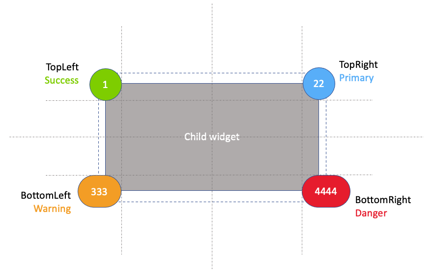

# design

Make a design of what the widget should do.

[back](../readme.md)

The Mendix ~~appstore~~ [marketplace](https://marketplace.mendix.com/) allready contains a badge compontents that can display a count in a badge. In this example we would like to make a badge component that can be wrapped arround any type of widget to display a count.

To do so, we our widget should be able to do the following things:

- It should be able to have other widgets placed in it.
- It should have a property that points to an integer that indicates the count
- It should have a property that indicates where the badge is displayed, like topleft, topright, bottomleft, bottomright
- It should have a property that specifies the color of the badge: 

So our design should do and look something like this:

[back](../readme.md)
