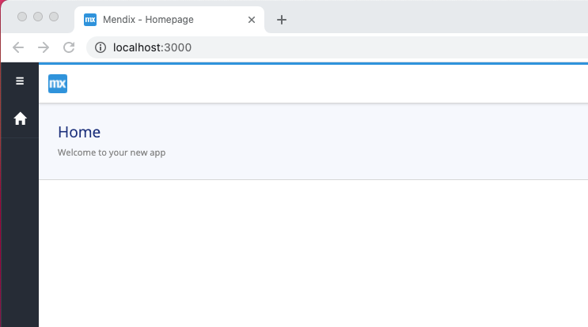
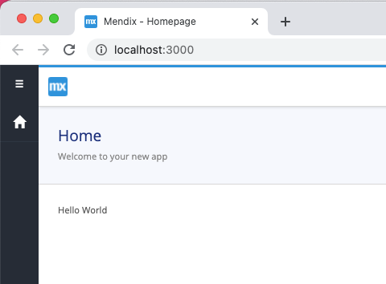

# Session two

[back](../readme.md)

**talks about**
How to create a custom widget based on the default widget by Yo.

Get started:
- Create a new project in Mendix.
- open terminal in that project
- ``mkdir CustomWidgets``
- ``cd CustomWidgets``
- ``yo @mendix/widget BubbleUp``
```
      __  ____   __            _     _            _    
     |  \/  \ \ / /           (_)   | |          | |   
     | \  / |\ V /   __      ___  __| | ____  ___| |_  
     | |\/| | > <    \ \ /\ / / |/ _  |/ _  |/ _ \ __| 
     | |  | |/ . \    \ V  V /| | (_| | (_| |  __/ |_  
     |_|  |_/_/ \_\    \_/\_/ |_|\__._|\__. |\___|\__| 
                                        __/ |          
                                       |___/           
     Generator, version: 8.14.0
     Issues? Please report them at : https://github.com/mendix/widgets-resources/issues
```
- Provide the following answers:
    - What is the name of your widget? **BubbleUp**
    - Enter a description for your widget **Create a bubble arround any type off widget**
    - Organization name **Mendix**
    - Add a copyright **2020 Mendix Technology BV**
    - Add a license **Apache-2.0**
    - Initial version **1.0.0**
    - Author **Willem (or your own name offcourse!)**
    - Mendix project path **../../**
    - Which programming language do you want to use for the widget? **TypeScript**
    - Which type of widget are you developing? **For web and hybrid mobile apps**
    - Which template do you want to use for the widget? **Empty widget (recommended for more experienced developers)**
    - Add unit tests for the widget ? (recommended for Full Boilerplate) **No**
    - Add End-to-end tests for the widget ? (recommended for Full Boilerplate) **No**

When the installation of the new widget has finished, change directory to the new folder:
    
``cd BubbleUp``

and run ``npm run start`` this should open a browser window, pointing to http://localhost:3000 

This will only show some content when you also run your mendix project, please do so, you should now see something like:



To actually show the widget on your homepage, do the following:
- In studio pro, perform the following actions:
    - ``Project -> Synchronize Project Directory``
    - This gives you a Bubble Up widget in the toolbox
    - Drag and dtop this widget on the home page
    - Run locally

You should now see something like this in the browser:



A good start, your first widget is actually working. In the following steps we will make the following changes:

1. [Change the icon in studio pro](1.createAnIcon/readme.md)
2. [Make a design on what the widget should do](2.design/readme.md)
3. [Make changes to the properties you can set in studio pro](3.properties/readme.md)
4. [Make the widget act on these properties](4.widget/readme.md)
5. [Working on styling](5.styling/readme.md)

[back](../readme.md)
